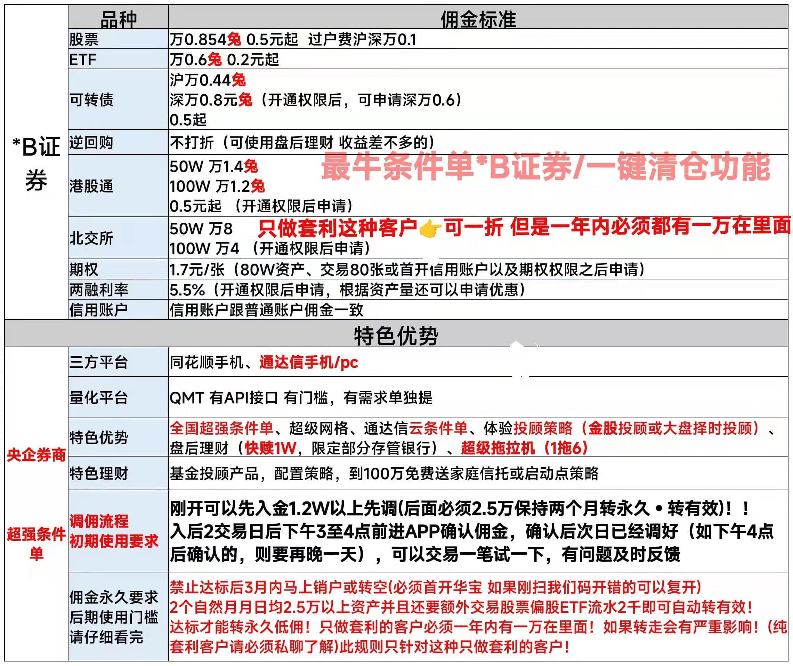

# 华宝证券

## 费率表

一年内保持一万在里面这个只是针对纯套利客户的要求，正常股票客户没有这个门槛要求。

## 开户门槛

2 个自然月月日均 2.5 万以上资产，并且还要有交易股票或偏股 ETF 交易流水 2 千元以上。

6月22日新增：纯套利的客户必须一年内都有一万在里面。（尽量不做纯套利客户）

6月30日新增：纯套利的客户必须一年内都有两万五在里面。（尽量不做纯套利客户）

所谓纯套利客户是指，开这个账户目的就是只做套利，后续没有买股票/ETF的打算。

纯套利客户不太受券商待见🤣，咱们开户尽量不要只做套利，也可以买点股票/ETF放着。

## 开户方式

**联系下方微信获取专属低佣开户链接**。

