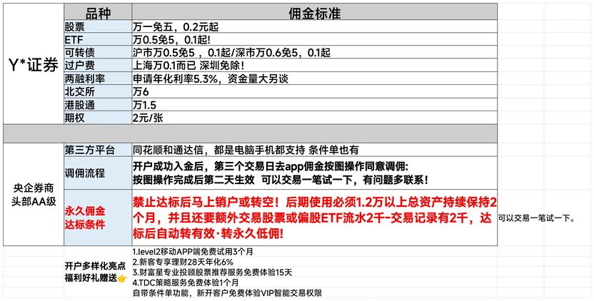

# 银河二开

可以二开免五LOF一折的银河，数量不多，优惠名额有限，先到先得。

二开的意思是：即使已经开过银河了，再开还是能享受免五的低佣费率。

一个人最多可以同时拥有 3 个银河证券账户。

## 费率表

## 开户门槛

2 个自然月月日均 1.2 万以上资产，并且还要有交易股票或偏股 ETF 交易流水 2 千元以上。

## 开户方式

**联系下方微信获取专属低佣开户链接**。

